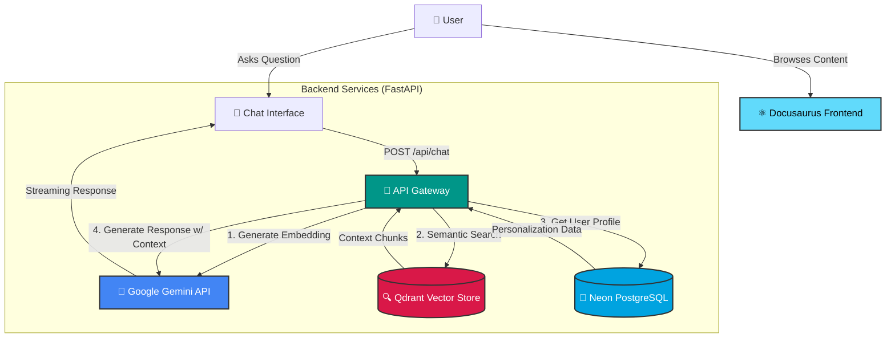

# Physical AI & Humanoid Robotics: A RAG-Powered Interactive Book

> **Bridging the gap between static textbooks and interactive AI tutoring.**

[](/specs/)
[](#-key-features)
[](#-tech-stack)

## 📖 Introduction

This project is not just a digital book; it is an **interactive learning platform** designed to teach "Physical AI & Humanoid Robotics". Unlike traditional static documentation, this platform integrates a **Retrieval-Augmented Generation (RAG)** chatbot that acts as a personalized tutor.

By combining the structured knowledge of a textbook with the adaptive intelligence of Google's Gemini models, users can ask questions, get code examples tailored to their hardware (e.g., Arduino vs. Raspberry Pi), and understand complex mathematical concepts with ease.

## ✨ Key Features

-   **🤖 Context-Aware RAG Chat**:
    -   Powered by **Google Gemini** embeddings and LLMs.
    -   Uses **Qdrant** vector search to retrieve precise book excerpts before answering.
    -   Eliminates hallucinations by grounding answers in the book's content.

-   **🎯 Adaptive Personalization**:
    -   The system learns your background (Software: Python/C++/ROS, Hardware: Arduino/Jetson/Rpi).
    -   **Tailored Explanations**: A C++ expert gets low-level code examples; a Python beginner gets simplified logic.
    -   **Dynamic Rewrites**: The "Personalize" feature rewrites entire sections of the book to match your expertise level on the fly.

-   **➗ Rigorous Mathematical Support**:
    -   Full support for rendering complex robotics formulas (Kinematics, Dynamics) using **KaTeX**.
    -   Equations are not just images but searchable, accessible text.

-   **⚡ Hybrid Architecture**:
    -   **Frontend**: Built with **Docusaurus** (React + TypeScript) for a blazing-fast, static-site-generated (SSG) reading experience.
    -   **Backend**: A robust **FastAPI** service handling real-time chat, vector similarity search, and user profile management.

## 🏗️ Architecture Overview

The system utilizes a decoupled, event-driven architecture designed for high scalability and separation of concerns.



-   **Frontend**: Docusaurus serves the static content (markdown files in `docs/`). It communicates with the backend via API calls for dynamic features (Chat, Profile).
-   **Backend**: FastAPI exposes endpoints for:
    -   `/api/chat`: Handles RAG pipeline (Query -> Embed -> Search Qdrant -> Generate Answer).
    -   `/api/personalize`: Rewrites text based on user profile.
    -   `/api/profile`: Manages user expertise settings (stored in PostgreSQL/Neon).
-   **Data Storage**:
    -   **Qdrant**: Stores vector embeddings of the book content for semantic search.
    -   **PostgreSQL (Neon)**: Stores user profiles and persistent chat history.

## 🛠️ Tech Stack

-   **Frontend**: React, TypeScript, Docusaurus, TailwindCSS (via custom CSS), KaTeX.
-   **Backend**: Python 3.10+, FastAPI, PyDantic.
-   **AI & ML**: Google Gemini (Embeddings + Flash Lite model), Qdrant (Vector Database).
-   **Infrastructure**: Docker (for containerization), Neon (Serverless Postgres).

## 🚀 Getting Started

### Prerequisites

-   **Node.js** (v18 or higher)
-   **Python** (v3.10 or higher)
-   **Docker** (optional, for Qdrant local instance)
-   **Google Gemini API Key**

### Installation

1.  **Clone the Repository**
    ```bash
    git clone https://github.com/burair-ahmed/my-ai-book-hackathon.git
    cd my-ai-book-hackathon
    ```

2.  **Backend Setup**
    ```bash
    cd backend
    python -m venv venv
    # Windows
    .\venv\Scripts\activate
    # Mac/Linux
    # source venv/bin/activate
    pip install -r requirements.txt
    ```
    Create a `.env` file in `backend/` with:
    ```env
    GOOGLE_API_KEY=your_key_here
    QDRANT_URL=your_qdrant_url
    QDRANT_API_KEY=your_qdrant_key
    NEON_DATABASE_URL=your_postgres_url
    ```
    Start the server:
    ```bash
    python main.py
    ```

3.  **Frontend Setup**
    Open a new terminal in the root directory:
    ```bash
    npm install
    npm start
    ```
    The book should now be running at `http://localhost:3000`.

## 📂 Project Structure

```
my-ai-book-hackathon/
├── backend/            # FastAPI Application
│   ├── src/            # Source code (api, services, models)
│   ├── main.py         # Entry point
│   └── verify_qdrant.py # Utility scripts
├── docs/               # The actual book content (Markdown)
├── src/                # Frontend React components (ChatBot, Profile)
├── docusaurus.config.ts # Site configuration
└── package.json        # Frontend dependencies
```

## 🗺️ Roadmap & Status

-   ✅ **Core RAG Pipeline**: Chat with the book using semantic search.
-   ✅ **User Personalization**: Basics implemented (Software/Hardware profiles).
-   ✅ **Math Rendering**: Full KaTeX support for robotics equations.
-   🚧 **Advanced Multi-modal Support**: Planned support for asking questions about diagrams.
-   🚧 **Community Features**: User annotations and "shared notes" are in early design.
